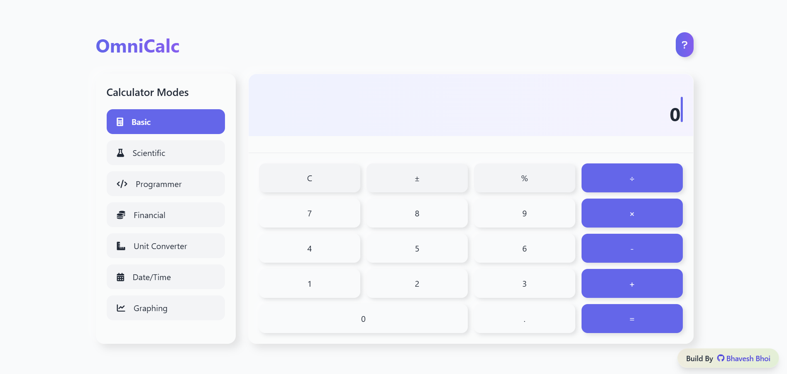

# OmniCalc - Universal Calculator



An all-in-one calculator for basic, scientific, programmer, financial, unit conversion, date/time, and graphing calculations.

OmniCalc is a versatile, web-based calculator designed to handle a wide range of calculations, from simple arithmetic to advanced scientific, financial, and graphing tasks. Built with modern web technologies, OmniCalc provides a sleek, user-friendly interface with light and dark theme support, responsive design, and a robust feature set.

[Try it live](https://bhavu7.github.io/OmniCalc/) | [Report Issue](https://github.com/Bhavu7/OmniCalc/issues)

## 🚀 Features

### Multiple Calculator Modes:
- **Basic Calculator**: Standard arithmetic operations with memory functions
- **Scientific Calculator**: Advanced math functions (trigonometry, logarithms, exponents, etc.)
- **Programmer Calculator**: Base conversions (HEX, DEC, OCT, BIN) and bitwise operations
- **Financial Calculator**: Loan and investment calculations with Indian Rupees (₹) support
- **Unit Converter**: Convert between various units of length, weight, volume, etc.
- **Date Calculator**: Date difference calculations and date arithmetic
- **Graphing Calculator**: Plot mathematical functions with zoom/pan controls

### Additional Features:
- 📜 Calculation history with recall functionality
- 📱 Responsive design for all devices
- ⌨️ Keyboard support for quick calculations
- 🎨 Modern UI with neumorphic design elements
- 🔓 Open source (MIT Licensed)

## 🛠️ Technologies Used

| Technology | Purpose |
|------------|---------|
| HTML5 | Application structure |
| CSS3/Tailwind CSS | Styling and responsive design |
| JavaScript (ES6+) | Core functionality |
| Chart.js | Graphing capabilities |
| Math.js | Advanced math computations |
| Font Awesome | Icons |

## 🌟 Support

If you like OmniCalc, please give it a ⭐ on GitHub! For issues or feature requests, create an issue on the GitHub repository.

## 📥 Installation

1. Clone the repository:
```bash
git clone https://github.com/Bhavu7/OmniCalc.git
